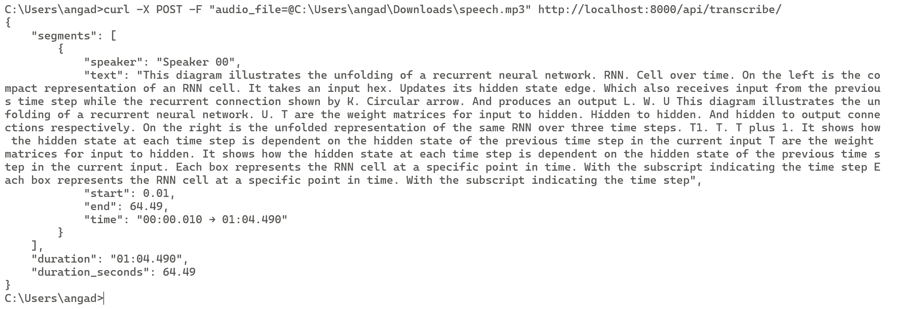
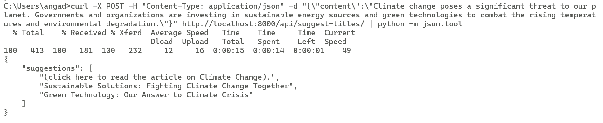

# Darwix-AI

A Django-based AI service that provides two main features:
1. Audio transcription with speaker diarization
2. AI-powered title suggestions for blog posts

## Features

* **Audio Transcription**: Uses Whisper for transcription and pyannote.audio for speaker diarization
* **Title Generation**: Uses facebook/opt-350m model to generate engaging titles for content
* **RESTful API**: Easy to integrate with any frontend application
* **Local Models**: All AI processing is done locally, no external API costs

## Screenshots

### Audio Transcription Example

*Example of audio transcription with speaker diarization and timestamps*

### Title Suggestions Example

*Example of AI-generated title suggestions for a blog post*

## Setup

1. Clone the repository:
```bash
git clone https://github.com/Angad-2002/Darwix-AI.git
cd Darwix-AI
```

2. Create and activate a virtual environment:
```bash
python -m venv venv
source venv/bin/activate  # On Windows: venv\Scripts\activate
```

3. Install dependencies:
```bash
pip install -r requirements.txt
```

4. Set up environment variables:
Create a `.env` file in the root directory with:
```
OPENAI_API_KEY=your_openai_api_key
HF_TOKEN=your_huggingface_token
```

5. Run migrations:
```bash
python manage.py migrate
```

6. Start the development server:
```bash
python manage.py runserver
```

## API Usage Examples

### 1. Audio Transcription

Transcribe an audio file with speaker diarization:

```bash
# Using curl
curl -X POST -F "audio_file=@path/to/your/audio.mp3" http://localhost:8000/api/transcribe/

# Using PowerShell
$filePath = "C:\path\to\your\audio.mp3"
$uri = "http://localhost:8000/api/transcribe/"

$fileBytes = [System.IO.File]::ReadAllBytes($filePath)
$boundary = [System.Guid]::NewGuid().ToString()
$LF = "`r`n"

$bodyLines = (
    "--$boundary",
    "Content-Disposition: form-data; name=`"audio_file`"; filename=`"audio.mp3`"",
    "Content-Type: audio/mpeg",
    "",
    [System.Text.Encoding]::UTF8.GetString($fileBytes),
    "--$boundary--"
) -join $LF

Invoke-RestMethod -Uri $uri -Method Post -ContentType "multipart/form-data; boundary=$boundary" -Body $bodyLines
```

Example Response:
```json
{
    "segments": [
        {
            "speaker": "Speaker 0",
            "text": "This is the transcribed text from the first speaker.",
            "start": 0.0,
            "end": 5.2,
            "time": "00:00.000 → 00:05.200"
        },
        {
            "speaker": "Speaker 1",
            "text": "This is the response from the second speaker.",
            "start": 5.5,
            "end": 8.7,
            "time": "00:05.500 → 00:08.700"
        }
    ],
    "duration": "00:08.700",
    "duration_seconds": 8.7
}
```

### 2. Title Suggestions

Get AI-generated title suggestions for your content:

```bash
# Using curl
curl -X POST -H "Content-Type: application/json" -d "{\"content\":\"Your blog post content here...\"}" http://localhost:8000/api/suggest-titles/

# Using PowerShell
$body = @{
    content = "Your blog post content here..."
} | ConvertTo-Json

Invoke-RestMethod -Uri "http://localhost:8000/api/suggest-titles/" -Method Post -Body $body -ContentType "application/json"
```

Example Response:
```json
{
    "suggestions": [
        "The Future of AI in Content Creation",
        "How Artificial Intelligence is Transforming Writing",
        "AI-Powered Content Generation: A New Era"
    ]
}
```

## Supported Audio Formats

- MP3 (.mp3)
- WAV (.wav)
- M4A (.m4a)
- OGG (.ogg)

Maximum file size: 10MB

## Error Handling

The API returns appropriate HTTP status codes and error messages:

- 400: Bad Request (invalid input)
- 500: Internal Server Error

Example error response:
```json
{
    "error": "Error message describing what went wrong"
}
```

## Contributing

1. Fork the repository
2. Create a feature branch
3. Commit your changes
4. Push to the branch
5. Create a Pull Request

## License

This project is licensed under the MIT License - see the LICENSE file for details.
